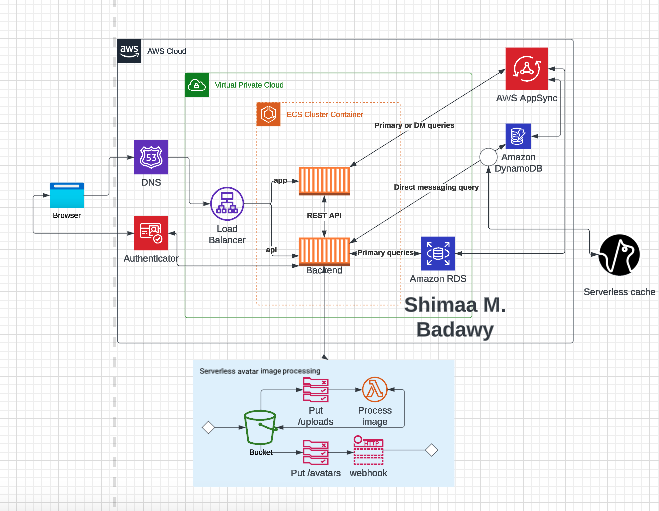
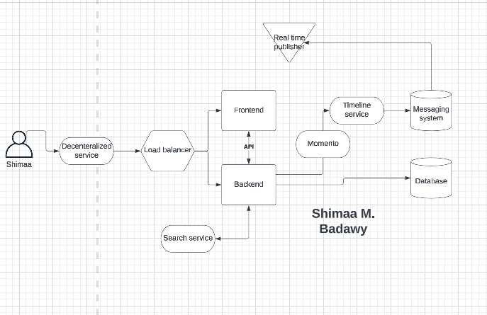

# Week 0 — Billing and Architecture
## Logical diagram ([LINK](https://lucid.app/lucidchart/4292c82d-57b2-43dc-923d-fd4450671b7f/edit?viewport_loc=-660%2C-325%2C2223%2C1789%2C0_0&invitationId=inv_147b1802-0510-48fc-92a1-c92a00737b9b))

## Conceptional diagram ([LINK](https://lucid.app/lucidchart/cc118109-ba31-41da-b485-a091ebc08b22/edit?viewport_loc=-730%2C-516%2C1968%2C1584%2C0_0&invitationId=inv_ea13b0c8-d2cc-450e-9532-a268f10331f8))

