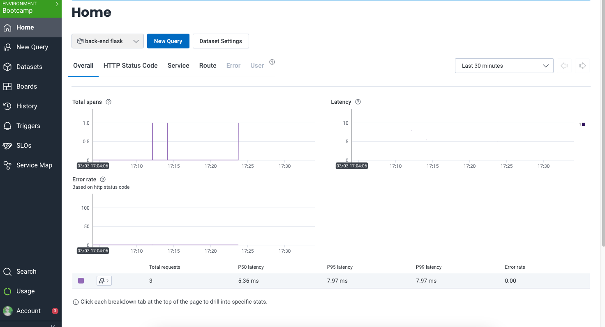
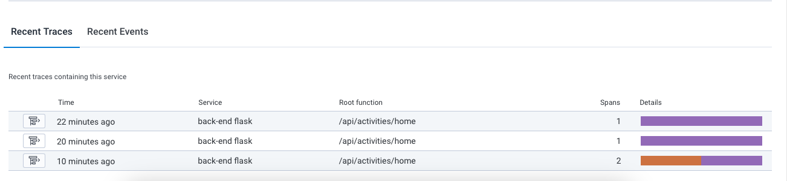
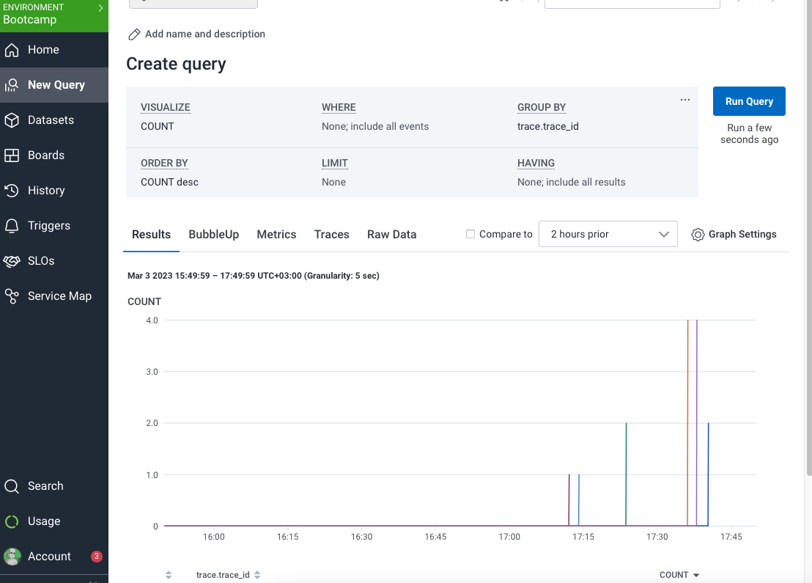
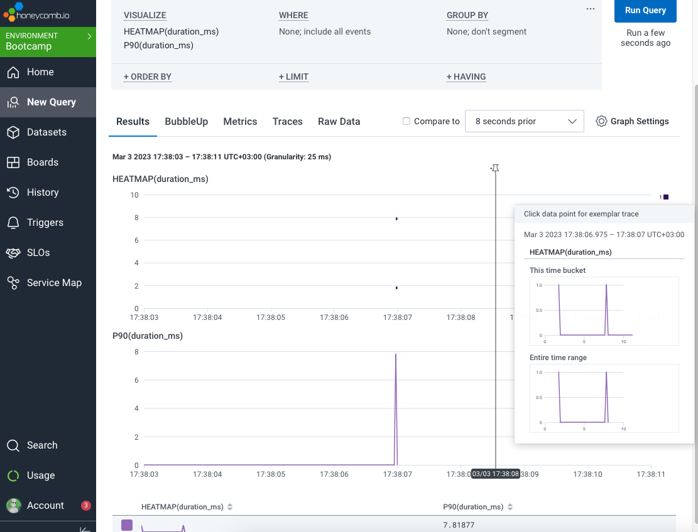
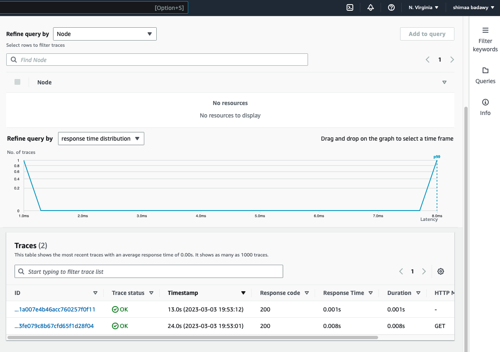
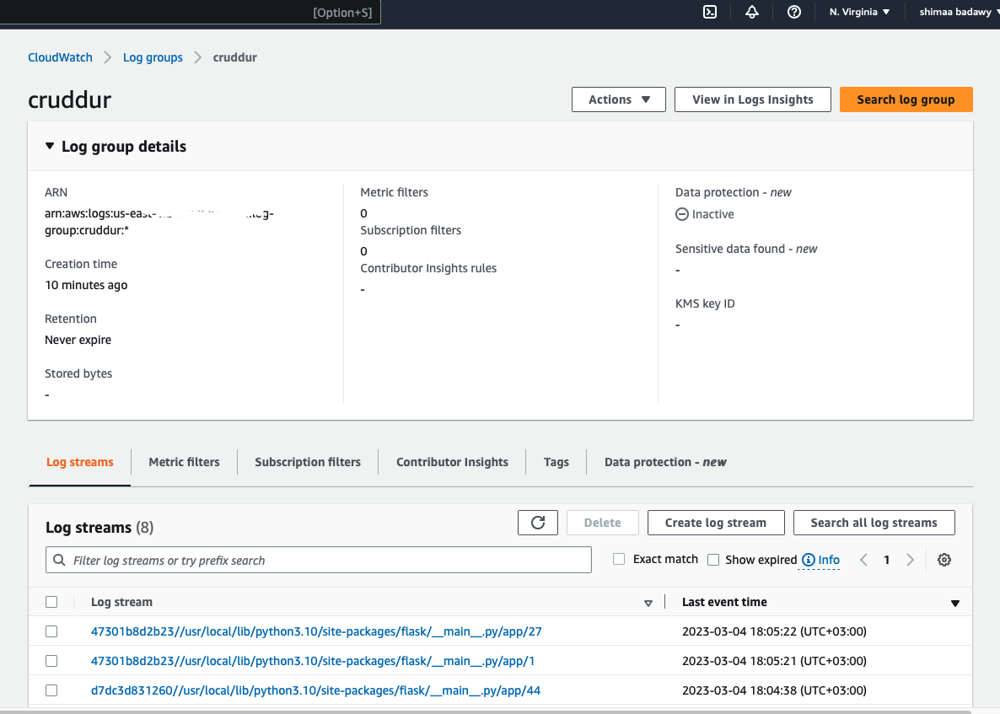
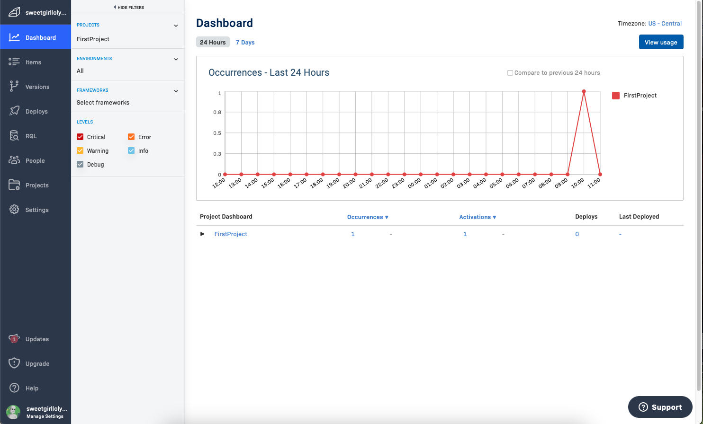

# Week 2 — Distributed Tracing

## Backend app.py imports and initialization for Honeycomp, xray, cloudwatch and rollbar
```
# Honeycomp -------------------
from opentelemetry import trace
from opentelemetry.instrumentation.flask import FlaskInstrumentor
from opentelemetry.instrumentation.requests import RequestsInstrumentor
from opentelemetry.exporter.otlp.proto.http.trace_exporter import OTLPSpanExporter
from opentelemetry.sdk.trace import TracerProvider
from opentelemetry.sdk.trace.export import BatchSpanProcessor

provider = TracerProvider()
processor = BatchSpanProcessor(OTLPSpanExporter())
provider.add_span_processor(processor)
trace.set_tracer_provider(provider)
tracer = trace.get_tracer(__name__)

FlaskInstrumentor().instrument_app(app)
RequestsInstrumentor().instrument()

# Xray ---------
from aws_xray_sdk.core import xray_recorder
from aws_xray_sdk.ext.flask.middleware import XRayMiddleware

xray_url = os.getenv("AWS_XRAY_URL")
xray_recorder.configure(service='Cruddur', dynamic_naming=xray_url)
XRayMiddleware(app, xray_recorder)

# Cloudwatch ----------
import watchtower
import logging
from time import strftime

LOGGER = logging.getLogger(__name__)
LOGGER.setLevel(logging.DEBUG)
console_handler = logging.StreamHandler()
cw_handler = watchtower.CloudWatchLogHandler(log_group='cruddur')
LOGGER.addHandler(console_handler)
LOGGER.addHandler(cw_handler)
LOGGER.info("some message")

# rollbar --------------- 
import rollbar
import rollbar.contrib.flask
from flask import got_request_exception

rollbar_access_token = os.getenv('ROLLBAR_ACCESS_TOKEN')
@app.before_first_request
def init_rollbar():
    """init rollbar module"""
    rollbar.init(
        # access token
        rollbar_access_token,
        # environment name
        'production',
        # server root directory, makes tracebacks prettier
        root=os.path.dirname(os.path.realpath(__file__)),
        # flask already sets up logging
        allow_logging_basic_config=False)

    # send exceptions from `app` to rollbar, using flask's signal system.
    got_request_exception.connect(rollbar.contrib.flask.report_exception, app)

```

## Honeycomp
Added env vars to the compose file 
```
OTEL_EXPORTER_OTLP_ENDPOINT: "https://api.honeycomb.io"
OTEL_EXPORTER_OTLP_HEADERS: "x-honeycomb-team=${HONEYCOMB_API_KEY}"
OTEL_SERVICE_NAME: "back-end flask"
```
Added a new trace and span attributes to [home_activities](backend-flask/services/home_activities.py)

```
with tracer.start_as_current_span("Show home activities"):
span = trace.get_current_span()
now = datetime.now(timezone.utc).astimezone()
span.set_attribute("app.now", now.isoformat())
span.set_attribute("app.result_length", len(results))
```




### Count and heatmap queries



## X-ray
Added env vars to the compose file and created a new segment in [user_activities](backend-flask/services/user_activities.py)
```
segment = xray_recorder.begin_segment('user_activities')  
model = {
  'errors': None,
  'data': None
}

now = datetime.now(timezone.utc).astimezone()

d = {'now' : now.isoformat()}
segment.put_metadata('key', d , 'namespace')
```
### X-ray reflectting on CloudWatch logs 



## CloudWatch logging
For cloud watch, the logging code was implemented:
```
import watchtower
import logging
from time import strftime

LOGGER = logging.getLogger(__name__)
LOGGER.setLevel(logging.DEBUG)
console_handler = logging.StreamHandler()
cw_handler = watchtower.CloudWatchLogHandler(log_group='cruddur')
LOGGER.addHandler(console_handler)
LOGGER.addHandler(cw_handler)
LOGGER.info("some message")
```



## Rollbar
In [home_activities](backend-flask/services/home_activities.py)
```
def run(logger):
    logger.info("Home activities")
    with tracer.start_as_current_span("Show home activities"):
      span = trace.get_current_span()
```



## Requirement file 
Those packages were added to the requirment file
```
opentelemetry-api 
opentelemetry-sdk 
opentelemetry-exporter-otlp-proto-http 
opentelemetry-instrumentation-flask 
opentelemetry-instrumentation-requests
aws-xray-sdk
watchtower
blinker
rollbar
```
