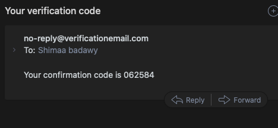
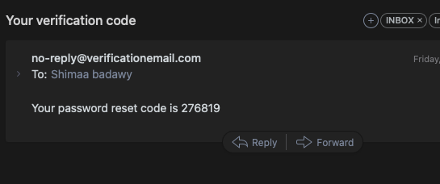
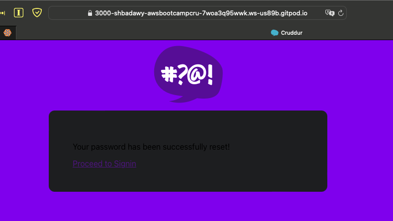
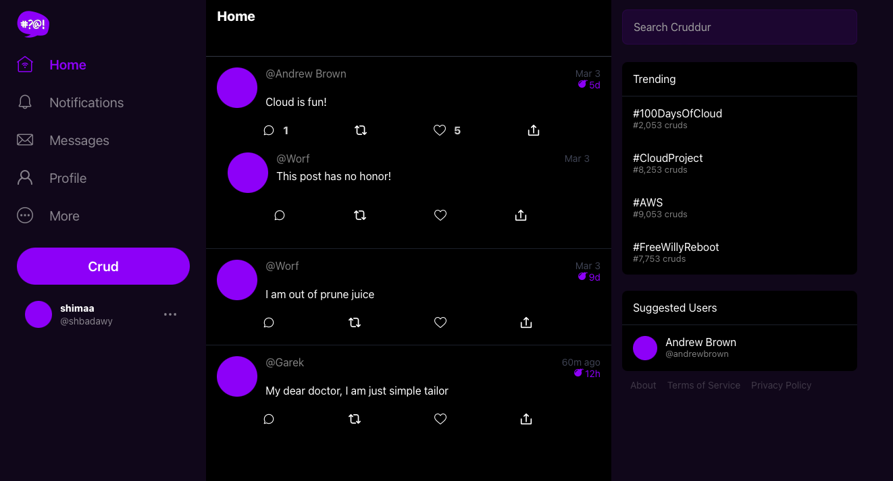

# Week 3 — Decentralized Authentication

## Docker-compose file
Added Cognito env vars 

```
      REACT_APP_AWS_PROJECT_REGION: "us-east-1"
      REACT_APP_AWS_COGNITO_REGION: "us-east-1"
      REACT_APP_AWS_USER_POOLS_ID: "us-east-1_4RhFsCvy4"
      REACT_APP_CLIENT_ID: "6ddk7eu0no4uas6bi108065dcb"
```

## Packages JSON file:
Installed and added Amplify to the packages json file by running  ```npm i aws-amplify --save ```. Amplify was added to the [package.json](frontend-react-js/package.json) as this (```"aws-amplify": "^5.0.16"```)

## Adding Amplify to pages:
Amplify was added to [App.js](frontend-react-js/src/App.js), [ProfileInfo.js](frontend-react-js/src/components/ProfileInfo.js), [HomeFeedPage.js](frontend-react-js/src/pages/HomeFeedPage.js), [SigninPage.js](frontend-react-js/src/pages/SigninPage.js), [SignupPage.js](frontend-react-js/src/pages/SignupPage.js) and [RecoverPage.js](frontend-react-js/src/pages/RecoverPage.js)

## Signup confirmation email


## Reset password confirmation email


## Signing in successfully 



